## Introduction

Barcelona's bike-sharing system is a vital component of the city's urban mobility infrastructure, providing residents and visitors with a sustainable transportation option. This project combines predictive modeling with comprehensive data analysis to understand bike availability patterns across Barcelona's bike stations.

The project addresses two key aspects:
1. **Prediction**: Forecasting the percentage of free docks at various stations throughout the city
2. **Analysis**: Understanding usage patterns across time, space, and other factors

By leveraging over 18 million records spanning from 2020 to 2024, this project provides valuable insights for both system operators and users, helping to optimize bike availability and improve the overall efficiency of Barcelona's bike-sharing network.

## Prediction Model

### Project Overview

This component was developed to predict bike dock availability in Barcelona's bike-sharing system. The main objective was to accurately forecast the percentage of free docks at various stations throughout the city based on historical data.

#### Key Challenges

- **Large Dataset Management**: Processing and analyzing over 18 million records spanning from 2020 to 2024
- **Feature Engineering**: Creating meaningful features from temporal and spatial data
- **Efficient Processing Pipeline**: Developing a scalable approach to handle the extensive historical data
- **Time Series Forecasting**: Implementing effective lag features to capture temporal patterns

#### Technologies Used

- **Python**: Primary programming language
- **Pandas & NumPy**: Data manipulation and numerical operations
- **LightGBM**: Gradient boosting framework for prediction
- **Optuna**: Hyperparameter optimization
- **Folium**: Geospatial visualization

### Data Understanding

#### Data Sources

The project utilized two primary datasets:

1. **Historical Data**: Time-series information about station status
   - Collected monthly from January 2020 to May 2024
   - Contains information about dock availability at different timestamps
   - Over 18 million records after processing

2. **Station Data**: Static information about each bicycle station
   - 516 unique stations across Barcelona
   - Contains geographical coordinates, capacity, and other station attributes

#### Key Variables

- **station_id**: Unique identifier for each bike station
- **last_reported**: Timestamp of when the station status was recorded
- **num_docks_available**: Number of available docks at the station
- **capacity**: Total number of docks at the station
- **lat/lon**: Geographical coordinates of the station

### Data Processing Pipeline

The data processing pipeline was designed to efficiently handle the large volume of data while creating meaningful features for prediction. The pipeline consists of several key steps:

#### 1. Data Loading and Cleaning

```python
def load_station_data():
    station_data = pd.read_csv('data/station_data/Informacio_Estacions_Bicing_2025.csv')
    return station_data

def prepare_historical_data(historical_data):
    # Drop unnecessary columns
    historical_data.drop(columns=['num_bikes_available_types.ebike', 'ttl',
       'num_bikes_available_types.mechanical', 'num_bikes_available', 'last_updated'], inplace=True)
    
    # Convert timestamp columns to datetime format
    historical_data['last_reported'] = pd.to_datetime(historical_data['last_reported'], unit='s')
    
    # Handle missing values
    numerical_cols = ['num_docks_available']
    for col in numerical_cols:
        if col in historical_data.columns and historical_data[col].isnull().sum() > 0:
            historical_data[col].fillna(historical_data[col].median(), inplace=True)
    return historical_data
```

The pipeline processes each monthly data file individually, which allows for efficient memory management when dealing with the large dataset. This approach prevents memory overflow issues that would occur if attempting to load all data at once.

#### 2. Feature Engineering

Several types of features were created to enhance the predictive power of the model:

##### Temporal Features

```python
# Extract date components
historical_data['year'] = historical_data['last_reported'].dt.year
historical_data['month'] = historical_data['last_reported'].dt.month
historical_data['day'] = historical_data['last_reported'].dt.day
historical_data['hour'] = historical_data['last_reported'].dt.hour
historical_data['date'] = pd.to_datetime(historical_data[['year', 'month', 'day']])

# Add time-based features
data['day_of_week'] = data['date'].dt.dayofweek
data['is_weekend'] = data['day_of_week'].isin([5, 6]).astype(int)
```

##### Spatial Features

```python
# Calculate distance from city center for each station
barcelona_center_lat = 41.3874
barcelona_center_lon = 2.1686

def haversine_distance(lat1, lon1, lat2, lon2):
    # Convert decimal degrees to radians
    lat1, lon1, lat2, lon2 = map(np.radians, [lat1, lon1, lat2, lon2])

    # Haversine formula
    dlon = lon2 - lon1
    dlat = lat2 - lat1
    a = np.sin(dlat/2)**2 + np.cos(lat1) * np.cos(lat2) * np.sin(dlon/2)**2
    c = 2 * np.arcsin(np.sqrt(a))
    r = 6371  # Radius of Earth in kilometers
    return c * r

data['distance_from_center'] = data.apply(
    lambda row: haversine_distance(row['lat'], row['lon'], barcelona_center_lat, barcelona_center_lon),
    axis=1
).round(3)
```

##### Target Variable Creation

```python
# Calculate the percentage of free docks (our target variable)
data['free_docks_percentage'] = (data['num_docks_available'] / data['capacity']).round(2)
```

#### 3. Time Series Lag Features

One of the most important aspects of the feature engineering process was the creation of lag features to capture temporal patterns in dock availability:

```python
# Sort data by station and time
df = complete_data.sort_values(by=['station_id', 'year', 'month', 'day', 'hour'])

# Create lag features
for lag in range(1, 5):
    complete_data[f'ctx-{lag}'] = complete_data.groupby('station_id')['free_docks_percentage'].shift(lag)

ctx_columns = ['ctx-1', 'ctx-2', 'ctx-3', 'ctx-4']

# Drop rows where any of these columns is NaN
complete_data = complete_data.dropna(subset=ctx_columns).reset_index(drop=True)
```

These lag features represent the percentage of free docks at 1, 2, 3, and 4 time steps prior to the prediction time, providing crucial temporal context for the model.

#### 4. Data Aggregation

To manage memory efficiently, the pipeline processes each monthly file individually and appends the results to a consolidated dataset:

```python
for file in csv_files:
    print(f'File {file} started!')
    file_path = os.path.join("./data", file)
    data = pd.read_csv(file_path)

    data = prepare_historical_data(data)
    data = create_hourly_avg_dataset(data)
    data = merge_data(data, station_data)
    data = create_additional_features(data)
    data = create_free_docks_percentage(data)
    data = drop_other_features(data)

    write_header = not os.path.exists("./data/historical_data.csv")
    data.to_csv("./data/historical_data.csv", mode='a', index=False, header=write_header)
    print(f"File loaded successfully with {data.shape[0]} rows.")
```

This approach allows for processing of the entire dataset without requiring all data to be loaded into memory simultaneously.

### Modeling Approach

#### Model Selection

LightGBM was chosen as the primary modeling algorithm for several reasons:

1. **Efficiency**: Ability to handle large datasets with millions of rows
2. **Performance**: Strong predictive performance on tabular data
3. **Feature Handling**: Effective handling of categorical and numerical features
4. **Speed**: Faster training compared to other gradient boosting frameworks

#### Hyperparameter Tuning with Optuna

A key aspect of the modeling approach was the use of Optuna for hyperparameter optimization. Optuna provides an efficient framework for exploring the hyperparameter space:

```python
def objective(trial):
    params = {
        'objective': 'regression',
        'metric': 'rmse',
        'verbosity': -1,
        'boosting_type': 'gbdt',
        'feature_pre_filter': False,
        'learning_rate': trial.suggest_float('learning_rate', 0.01, 0.3),
        'num_leaves': trial.suggest_int('num_leaves', 20, 300),
        'max_depth': trial.suggest_int('max_depth', 3, 12),
        'min_data_in_leaf': trial.suggest_int('min_data_in_leaf', 10, 100),
        'feature_fraction': trial.suggest_float('feature_fraction', 0.6, 1.0),
        'bagging_fraction': trial.suggest_float('bagging_fraction', 0.6, 1.0),
        'bagging_freq': trial.suggest_int('bagging_freq', 1, 7),
    }
    model = lgb.train(params, train_data, valid_sets=[val_data], callbacks=[lgb.early_stopping(stopping_rounds=50), lgb.log_evaluation(0)])
    preds = model.predict(X_val)
    rmse = mean_squared_error(y_val, preds)
    return rmse

# Run tuning
study = optuna.create_study(direction='minimize')
study.optimize(objective, n_trials=10)

# Best parameters
best_params = study.best_trial.params
print("Best Hyperparameters:", best_params)
```

The optimization process explored different combinations of:
- Learning rate
- Number of leaves
- Maximum tree depth
- Minimum data in leaf
- Feature and bagging fractions
- Bagging frequency

After 10 trials, the best hyperparameters were:
```
{
    'learning_rate': 0.25228929520822735, 
    'num_leaves': 246, 
    'max_depth': 8, 
    'min_data_in_leaf': 29, 
    'feature_fraction': 0.8385602398609304, 
    'bagging_fraction': 0.9382375139085373, 
    'bagging_freq': 3
}
```

#### Model Training and Evaluation

The dataset was split into training (60%), validation (20%), and test (20%) sets:

```python
# First split: Train + Val and Test
X_temp, X_test, y_temp, y_test = train_test_split(X, y, test_size=0.2, random_state=42, shuffle=True)

# Second split: Train and Val
X_train, X_val, y_train, y_val = train_test_split(X_temp, y_temp, test_size=0.25, random_state=42, shuffle=True)
# Result: 60% train, 20% val, 20% test
```

The final model was trained using the optimized hyperparameters:

```python
final_params = {
    'objective': 'regression',
    'metric': 'rmse',
    'verbosity': -1,
    'boosting_type': 'gbdt',
    **best_params
}

model = lgb.train(
    final_params,
    train_data,
    valid_sets=[val_data],
    callbacks=[lgb.early_stopping(stopping_rounds=50), lgb.log_evaluation(50)]
)
model.save_model('lightgbm_free_docks_model.txt')
```

### Results and Visualization

#### Model Performance

The model achieved strong performance across all evaluation sets:

| Metric | Train | Validation | Test |
|--------|-------|------------|------|
| MSE    | 0.0094| 0.0095     | 0.0095|
| RMSE   | 0.0970| 0.0972     | 0.0973|
| MAE    | 0.0626| 0.0628     | 0.0628|
| R²     | 0.8768| 0.8762     | 0.8760|

The consistent performance across train, validation, and test sets indicates that the model generalizes well and is not overfitting.

## Bike Usage Analysis

This section explores the patterns and factors influencing bike usage across Barcelona's bike-sharing system, providing valuable insights for both users and system operators.

### Temporal Patterns

#### Hourly Usage Patterns

Analysis of hourly usage reveals clear commuting patterns with two distinct peaks:
- **Morning Peak (7-9 AM)**: Corresponds to morning commute hours
- **Evening Peak (5-7 PM)**: Corresponds to evening commute hours

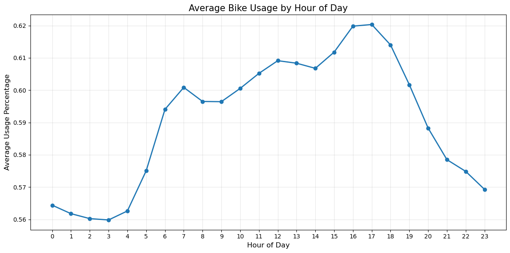
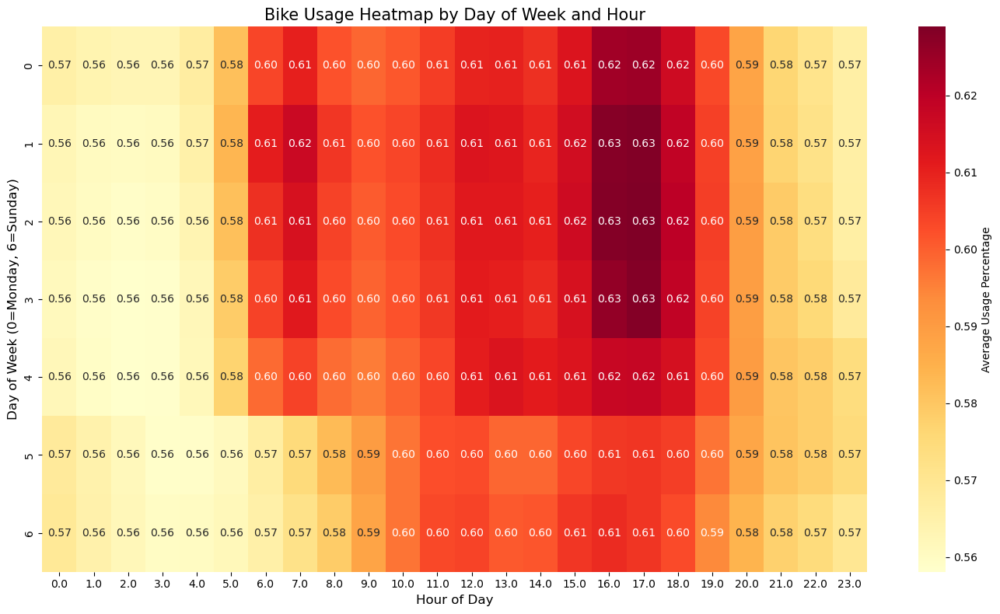

- **Weekends**: Display a pronounced usage only during the afternoon

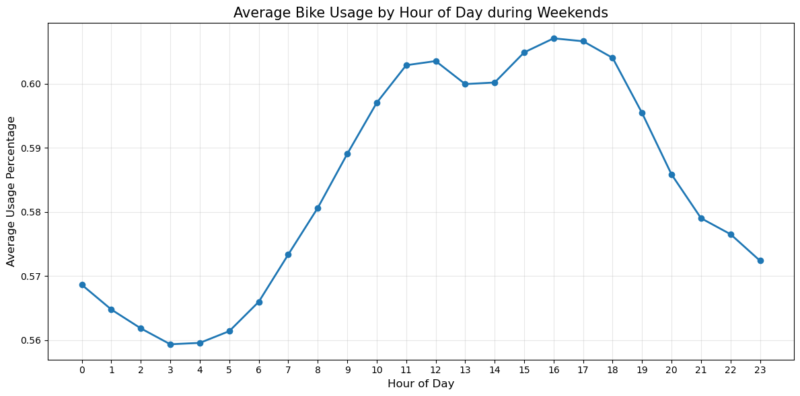

#### Daily and Weekly Patterns

- **Weekday vs. Weekend**: Weekdays show higher overall usage than weekends, with weekday usage concentrated around commute hours

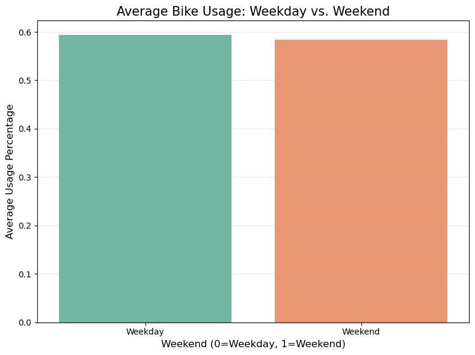

- **Day of Week**: Tuesday through Thursday typically show the highest usage rates, while Sunday has the lowest

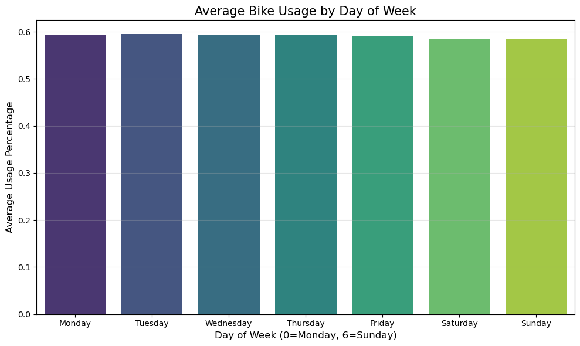

#### Seasonal Patterns

- **Monthly Variation**: Usage is highest during months July to November

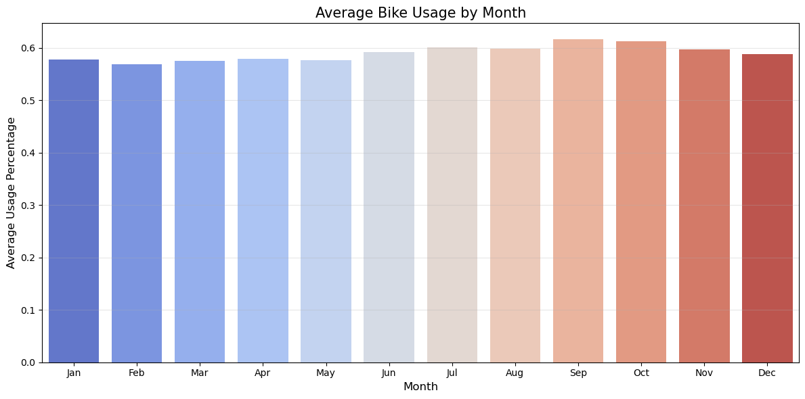

- **Yearly Trends**: Analysis across 2020-2023 shows increasing usage trends, with 2023 having the highest average usage rates

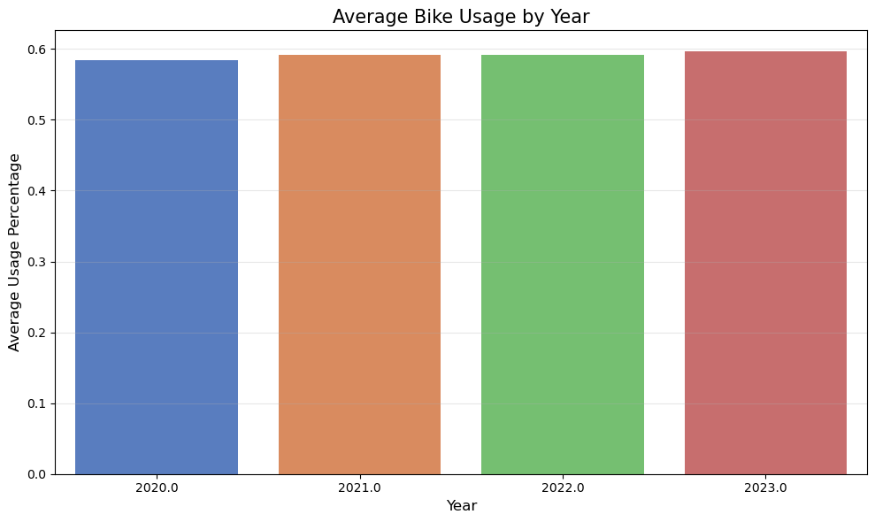

### Spatial Analysis

#### Usage by Distance from City Center

Stations closer to the city center show significantly higher usage rates:
- **Central Stations (0-2 km)**: Highest usage rates
- **Mid-Distance (2-5 km)**: Moderate usage
- **Peripheral (>5 km)**: Lower usage

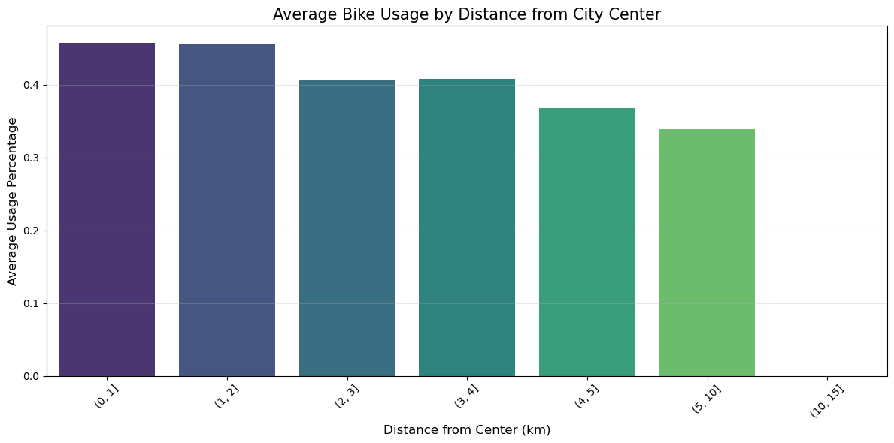

This pattern indicates a concentration of bike usage in central Barcelona, likely due to higher population density, tourist attractions, and business districts.

#### Usage by Altitude

Stations at lower altitudes have higher usage rates:
- **Low Altitude (0-20m)**: Highest usage
- **Medium Altitude (20-50m)**: Moderate usage
- **High Altitude (>50m)**: Lower usage

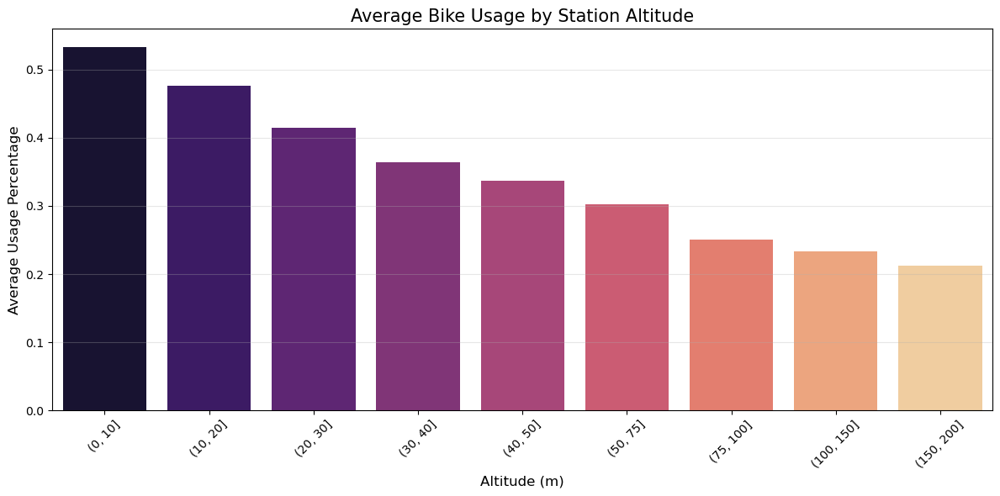

This pattern suggests users prefer flatter routes, avoiding uphill rides when possible.

#### Usage Heatmaps by Time Period

Spatial analysis through heatmaps reveals different usage patterns during various time periods:
- **Morning Rush Hour**: High concentration in business districts and along major commuting routes

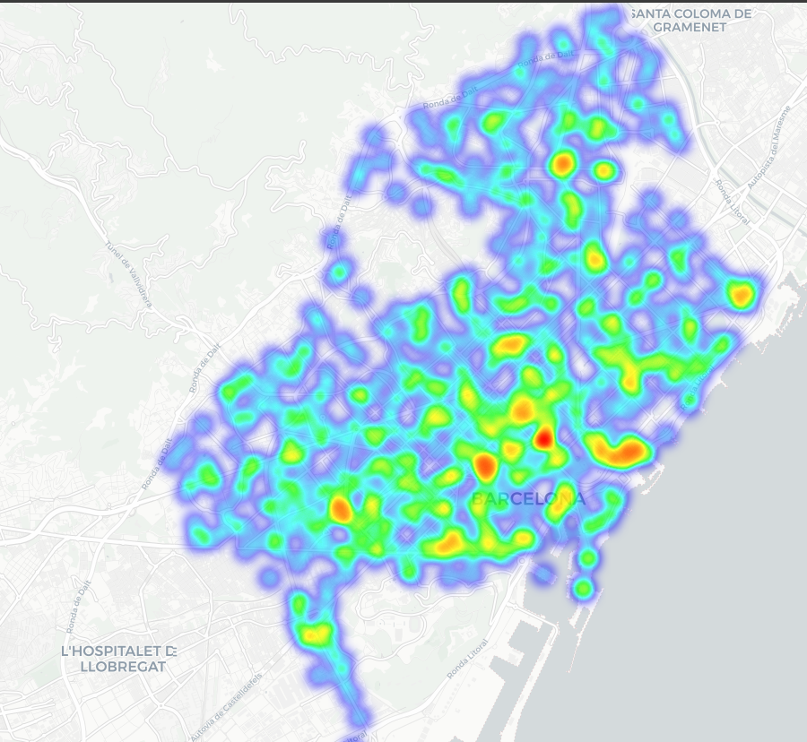

- **Evening Rush Hour**: More dispersed pattern with high usage in residential areas

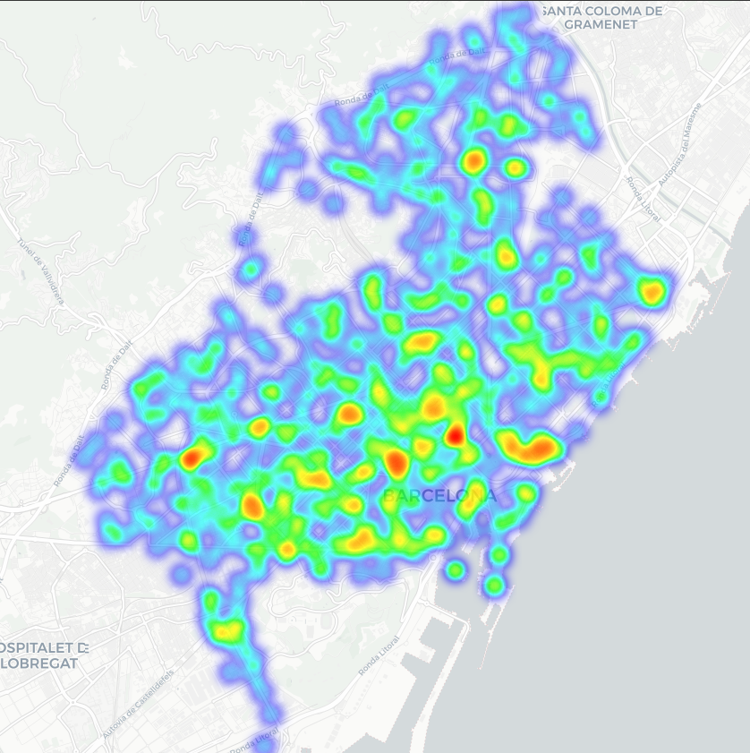

- **Weekend Daytime**: Concentration around recreational areas, parks, and tourist attractions

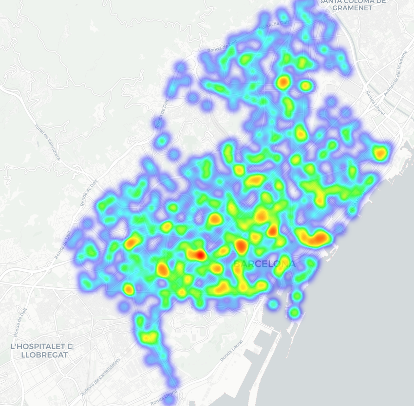

- **Nighttime**: Limited usage concentrated in entertainment districts and late-night activity centers

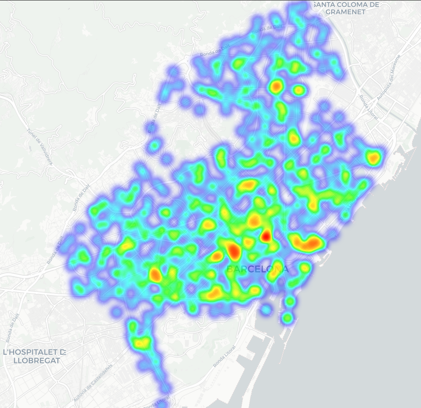

### Station Capacity Analysis

Analysis of the relationship between station capacity and usage reveals:
- **Medium-sized stations (20-40 docks)**: Tend to have the highest usage rates
- **Very small (<15 docks) and very large (>50 docks) stations**: Show lower average usage rates

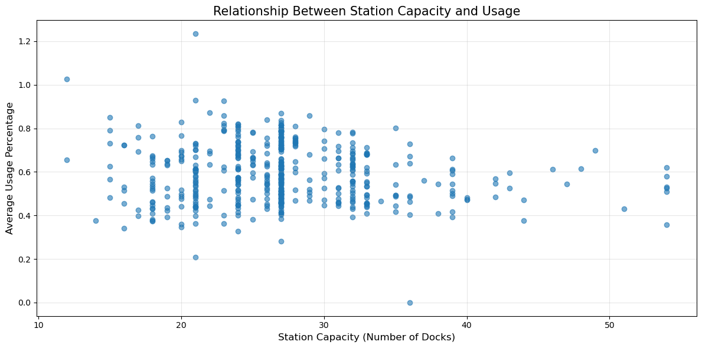

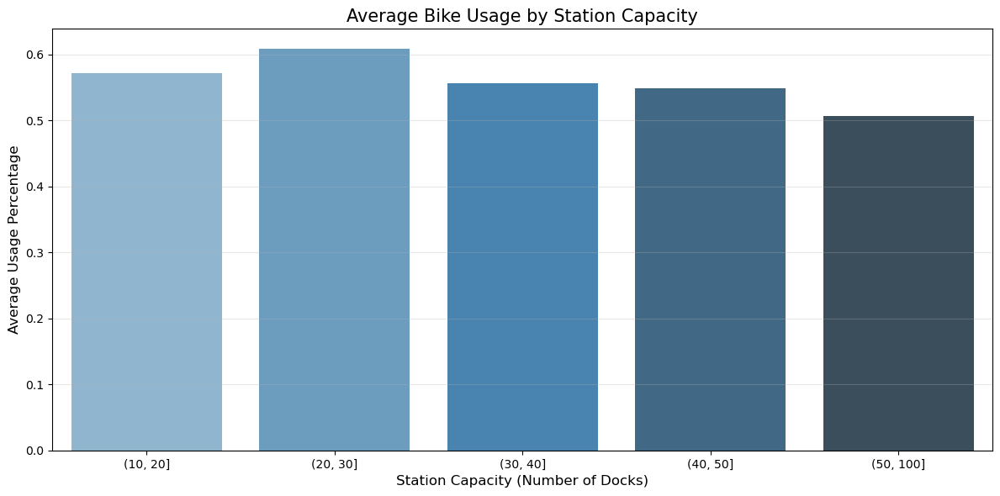

This pattern suggests an optimal station size for operational efficiency, balancing availability with maintenance requirements.

### Key Insights

1. **Predictable Usage Patterns**: Bike usage follows highly predictable temporal patterns, with clear daily, weekly, and seasonal cycles
2. **Spatial Concentration**: Usage is concentrated in central, flat areas of the city
3. **Commuting Dominance**: The system is heavily used for commuting, as evidenced by weekday peaks
4. **Station Size Matters**: Medium-sized stations show optimal usage rates

## Conclusion

This project successfully combined predictive modeling with comprehensive data analysis to understand and forecast bike availability in Barcelona's bike-sharing system. The predictive model achieved strong performance (R² of 0.876), while the analysis component revealed valuable insights into usage patterns across time and space.

The combination of prediction and analysis provides a powerful tool for both system operators and users:
- **For Operators**: Insights for optimizing station placement, capacity, and rebalancing strategies
- **For Users**: Understanding of availability patterns to better plan their trips

By leveraging data science techniques on a large historical dataset, this project contributes to the optimization and improvement of urban mobility in Barcelona, promoting sustainable transportation options in the city.
